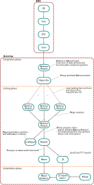

# Overview

Asterius compiles Haskell code to [WebAssembly](https://webassembly.org/)
(Wasm). Its frontend is based on [GHC](https://www.haskell.org/ghc/).

The Asterius pipeline provides everything to create a Wasm instance which
exports two functions (``hs_init`` and ``main``) that can be called from
JavaScript to execute the main Haskell program.

## Asterius pipeline

